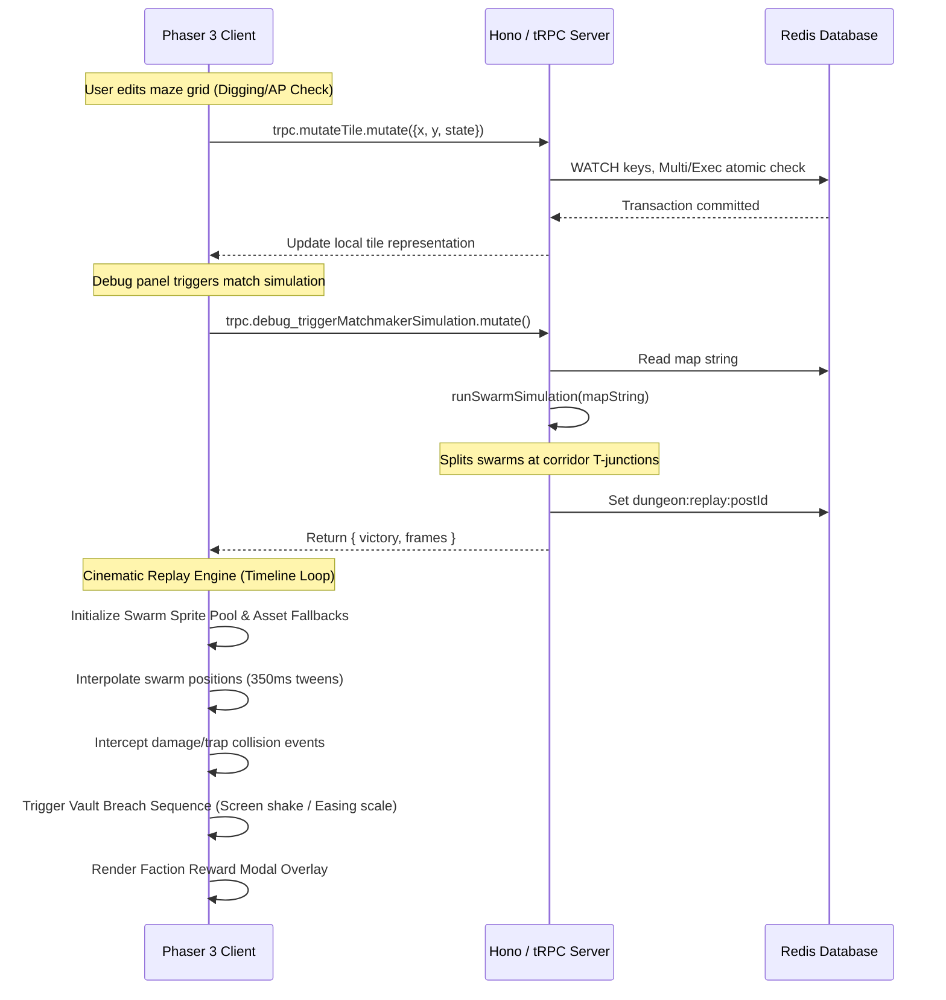

# SiegeTheThread Final Architecture & Evaluation Reference

This document serves as the primary system reference for the **SiegeTheThread** simulation and cinematic playback engine.

---

## 🏗️ End-to-End Operational Sequence

The engine operates on a deterministic, server-simulated, client-rendered replay architecture:



1. **Grid Editing & Blueprint (Defender)**: A player chooses their Diablo-style Class and Daily Operational Role (Attacker or Defender). Defenders spend up to 20 Action Points (AP) daily to digitize pathways (dig) or walls in a 16x16 grid.
2. **Matchmaker Simulation (Server)**: When a match is triggered (e.g. via debug panel), the server retrieves the 256-character map string from Redis. It runs a server-side swarm pathfinding simulation from $(0,0)$ to the Vault at $(15,15)$. The swarm splits at junctions, tracking fractional division counts frame-by-frame. The resulting tick-by-tick frames ledger is saved to Redis.
3. **Cinematic Playback (Phaser Client)**: The client ingests the complete frame history. Rather than jumping cell-by-cell, the client performs positional interpolation using Phaser tweens over 350ms, dynamically pooling sprite containers to reflect splits and merges.
4. **Visual Polish (FX Pipeline)**:
   - **Towers & Projectiles**: Active defense towers are dynamically spawned adjacent to paths. As swarms enter range or suffer losses, towers shoot laser projectiles.
   - **Explosions & Traps**: Moving swarm clusters that enter trap coordinates or decrease in number trigger high-density orange particle streams.
   - **Vault Breach**: An Attacker reaching $(15,15)$ triggers an elastic chest scale-up and camera viewport shake.
5. **Faction Reward Scoreboard**: Once the timeline concludes, input is blocked, a dark blurred backdrop is rendered, and an animated scoreboard ledger rolls up gold and skill shards rewards.

---

## 📂 Codebase Structure

The project code is divided into three cleanly isolated modules:

- **`src/shared/`**:
  - `grid.ts`: Defines the 16x16 grid model, boundaries, and validation algorithms.
  - `protocol.ts`: Houses the type-safe contracts for client-server communication via tRPC (class/role types, payload schemas).
- **`src/server/`**:
  - `index.ts`: The main server entry point utilizing Hono to host endpoints.
  - `trpc.ts`: Handles Redis transaction management, daily AP restrictions, and triggers the simulation.
  - `utils/simulation.ts`: Contains the server-side A* pathfinding and swarm split-simulation engine.
- **`src/client/`**:
  - `game.ts`: Initializes the Phaser 3 canvas with strict viewport mapping.
  - `scenes/Boot.ts`: Handles initial loader logic.
  - `scenes/GameScene.ts`: Contains the primary gameplay scene, onboarding flow, debug panel, particle emitters, object pooling, and reward modal overlay.

---

## 🎮 Judge Evaluation Handbook

Follow these steps to deploy and test the system locally:

1. **Install Dependencies**:
   ```bash
   npm install
   ```
2. **Run Dev Environment**:
   ```bash
   npm run dev
   ```
   *Note: This starts the Devvit playtest server locally.*

3. **Trigger Replay Simulation**:
   - Launch the game view.
   - Select **Sorcerer / Defender** (or any class) to enter the blueprint screen.
   - Dig a maze of paths starting from the top-left $(0,0)$ toward the bottom-right $(15,15)$.
   - Click the **⚙️ DEBUG** button on the top-left.
   - Select **Trigger Matchmaker Now**.
   - Watch the cinematic replay play out:
     - Observe the blue swarms split smoothly down paths with real-time text counters.
     - Observe towers firing yellow projectives and traps exploding with flame particle VFX.
     - If the path successfully connects, observe the chest elastic scaling and camera shake at $(15,15)$.
   - View the final faction reward summary overlay rolling up gold/shard points, and click **Close & Return to Blueprint** to reset.
