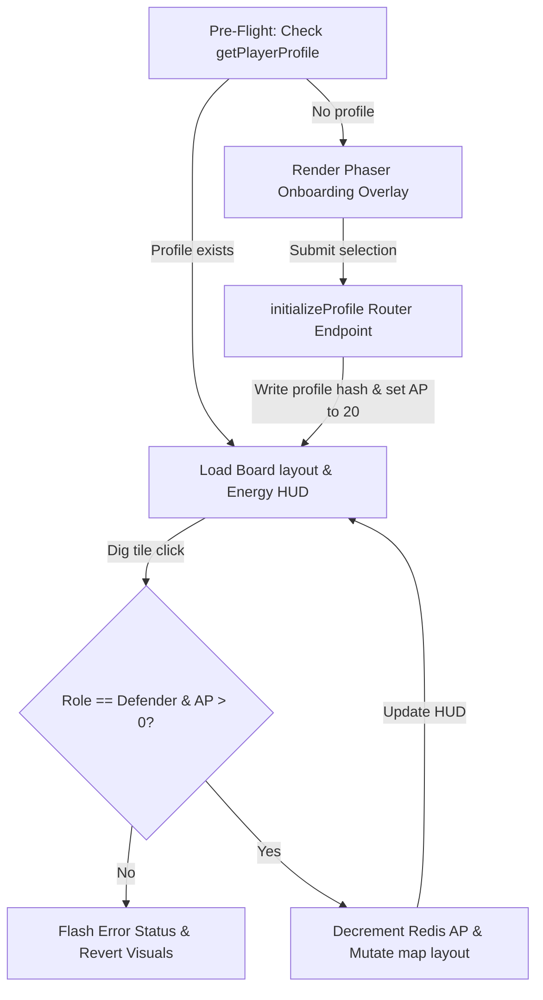

# Milestone 3 - Player Profiles, Diablo-style Class Configuration, and Authorization Boundaries

Milestone 3 implements user profiles, character class customization, dynamic role mapping, server-side verification of Action Points (AP) to restrict daily grid modifications, and a floating debug toolkit.

---

## 1. Data Schema & Redis Layout

### 1.1 Player Profile Data Hash
- **Redis Key**: `player:profile:${userId}`
- **Data Type**: Hash
- **Fields**:
  - `class`: `"Barbarian"` | `"Sorcerer"` | `"Rogue"` (selected at onboarding)
  - `role`: `"Attacker"` | `"Defender"` (determines layout manipulation permissions)
  - `level`: `number` (Default: `1`)
  - `experience`: `number` (Default: `0`)

### 1.2 Player Daily Action Token
- **Redis Key**: `player:ap:${userId}:${currentDateString}`
- **Data Type**: Integer (String formatted in Redis)
- **Description**: Tracks mutation energy for the calendar day (Default: 20 for Defenders, 0 for Attackers).

---

## 2. Life-Cycle Workflow

---

## 3. Dev-Only Debug Panel Manifest

A persistent floating button marked **⚙️ DEBUG** is displayed in the bottom-left corner of the Phaser canvas. Clicking this button expands/collapses the debugging utility.

### Available Backdoor Controls
1. **`[Toggle Role]`**
   - **Endpoint**: `debug_setPlayerRole`
   - **Function**: Switches player role instantly from Attacker to Defender or vice-versa. If switched to Defender, AP is fully refilled. The canvas updates dynamically.
2. **`[Refill AP]`**
   - **Endpoint**: `debug_refillEnergy`
   - **Function**: Commands the server to instantly reset remaining AP tokens to 20.
3. **`[Trigger Matchmaker Now]`**
   - **Endpoint**: `debug_triggerMatchmakerSimulation`
   - **Function**: Triggers a pathfinding traversal from `(0,0)` to `(15,15)` using a BFS algorithm traversing path tiles (`1`). If successful, the path coordinates are returned and visually flashed in neon cyan (`0x00b4d8`) sequentially across the Phaser grid.
4. **`[Full Reset]`**
   - **Endpoint**: `debug_fullReset`
   - **Function**: Deletes the player profile, deletes the daily AP balance, and resets the board layout back to all-stone walls (`0`). Triggers the character creation workflow again on the client canvas.
